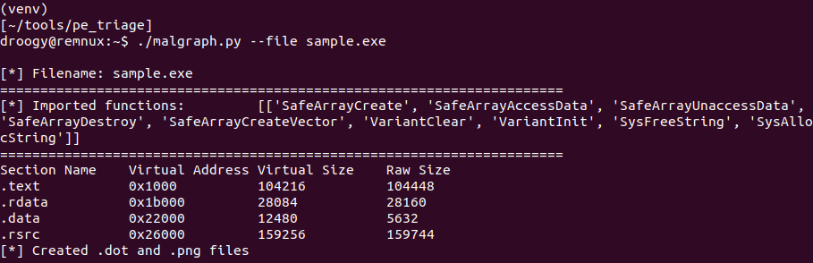

# Malgraph  
Visualize PE files and their function imports. 
## Description  
Malgraph is a utility that processes 32/64bit PE malware samples and their function imports and section names. These attributes are used to generate both a DOT file (allowing you to customize and fine-tune image generation) and a PNG image.  

## Example Output  
  
  

## Getting Started
### Dependencies  
**You need these for the program to work**  
To avoid re-inventing the wheel, I took some liberties and utilized some python libraries.  
It's highly recommended that you first use a python virtual environment - then install with `pip install -r requirements.txt`.

### Executing program
Specify path to sample with `--file` switch.  
` python malgraph.py --file sample.exe `  
## Authors  
[@0xDroogy](https://twitter.com/0xDroogy)